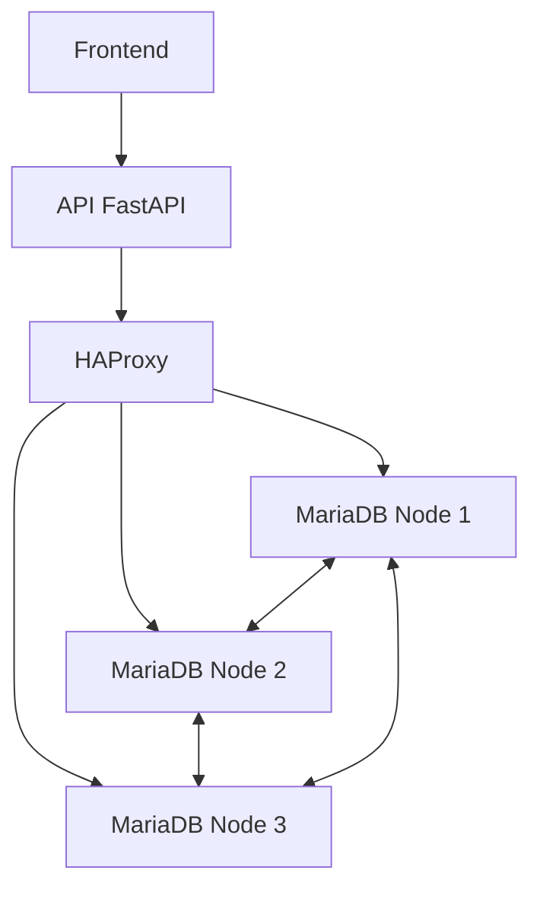

# Système de Réservation d'Événements

Ce projet est une application web complète de réservation d'événements, construite avec une architecture moderne et hautement disponible.

## Architecture

### Frontend
- Interface utilisateur responsive avec Bootstrap 5
- JavaScript vanilla pour la gestion des interactions
- Deux interfaces distinctes :
  - Interface publique pour les utilisateurs (réservation d'événements)
  - Interface d'administration (gestion des événements)

### Backend
- API REST avec FastAPI (Python)
- Architecture Clean avec séparation des couches :
  - Domain (entités et logique métier)
  - Infrastructure (persistance et API)
  - Application (services)

### Base de données
- Cluster MariaDB Galera (3 nœuds)
- HAProxy pour la répartition de charge
- Haute disponibilité et réplication synchrone

## Fonctionnalités

### Interface Utilisateur
- Consultation des événements disponibles
- Recherche par catégories
- Réservation de places
- Gestion des réservations (confirmation, annulation)

### Interface Administrateur
- Gestion complète des événements
- Création et modification d'événements
- Ajout de sessions
- Suivi des réservations

## Prérequis
- Docker
- Docker Compose
- Git

## Installation

1. Cloner le repository :
```bash
git clone <repository-url>
cd event-booking
```

2. Démarrer l'application :
```bash
docker-compose up -d
```

3. Initialiser la base de données :
```bash
# Les scripts d'initialisation s'exécutent automatiquement
# Attendre environ 30 secondes que le cluster soit opérationnel
```

## Accès aux interfaces

- Interface utilisateur : http://localhost:8080
- Interface administrateur : http://localhost:8080/admin.html
- API : http://localhost:18000
- HAProxy Stats : http://localhost:18404

## Structure de la Base de Données

### Tables principales
- `events` : Informations sur les événements
- `sessions` : Sessions disponibles pour chaque événement
- `bookings` : Réservations des utilisateurs
- `event_categories` : Catégories des événements

## Architecture Technique



## Haute Disponibilité

Le système utilise plusieurs niveaux de redondance :
- Cluster MariaDB Galera à 3 nœuds
- HAProxy pour la répartition de charge
- Réplication synchrone des données

## Développement

### Structure du Projet
```
event_booking/
├── frontend/           # Interface utilisateur
├── domain/            # Logique métier
├── infrastructure/    # Couche d'accès aux données
├── config/           # Fichiers de configuration
└── tests/            # Tests automatisés
```

### API Endpoints

#### Événements
- `GET /events/` : Liste des événements
- `POST /events/` : Création d'un événement
- `GET /events/{id}` : Détails d'un événement
- `DELETE /events/{id}` : Suppression d'un événement

#### Sessions
- `POST /events/{id}/sessions` : Ajout d'une session
- `GET /events/{id}/sessions` : Liste des sessions

#### Réservations
- `POST /bookings/` : Création d'une réservation
- `GET /bookings/{id}` : Détails d'une réservation
- `POST /bookings/{id}/confirm` : Confirmation
- `POST /bookings/{id}/cancel` : Annulation

## Maintenance

### Surveillance
- HAProxy Stats : http://localhost:18404
- Logs des conteneurs : `docker-compose logs`

### Sauvegarde
Les données sont persistées dans des volumes Docker :
- `mariadb1_data`
- `mariadb2_data`
- `mariadb3_data`

## Résolution des Problèmes

### Problèmes Courants

1. Si le cluster ne démarre pas :
```bash
docker-compose down
docker volume prune  # Attention : supprime les données
docker-compose up -d
```

2. Si l'API n'est pas accessible :
```bash
docker-compose restart api
```

3. Si la base de données est inaccessible :
```bash
docker-compose restart haproxy
```

## Sécurité

- CORS configuré pour le développement local
- Validation des données côté serveur
- Gestion des erreurs robuste
- Pas de données sensibles exposées

## Licence

Ce projet est sous licence MIT. Voir le fichier LICENSE pour plus de détails. 